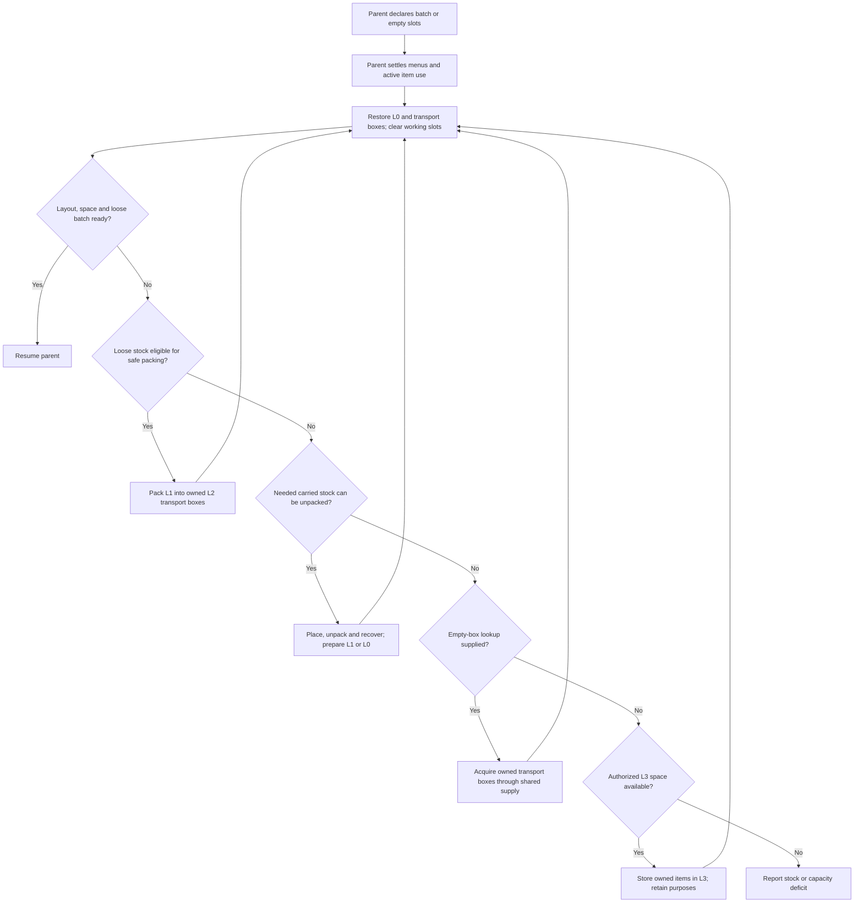

# Inventory levels

Inventory levels determine where items belong, how they reach the Bot's hands and when to arrange them. [Stock requirements](./stock) express quantities. The material ledger owns item obligations and reservations.

Current integration limits: excavation still triggers site deposits from physical empty-slot counts without first requesting shared L1/L2 turnover. Site containers use excavation cargo/depot records rather than the common L3 stock ledger. This page describes the shared inventory interface; it does not establish that every caller's capacity decisions and external stock have been migrated.

## Four levels

| Level | Purpose | Default main-inventory quota |
| --- | --- | --- |
| L0 | Reserved tools, rockets and food, plus temporary working slots | 12 slots |
| L1 | Directly usable items for the current task | 8 slots |
| L2 | Owned transport shulker boxes and their contents | 16 slots |
| L3 | Workstations or external containers explicitly assigned to the execution | Container capacity |

Quotas define permitted slots. Transport requirements determine how many boxes occupy L2. Armor uses separate head, chest, leg and foot slots; the chest slot holds elytra. Ender inventory retains the `ENDER` identifier with an `UNSUPPORTED` observation.

## Default L0 layout

These are internal main-inventory indices; the hotbar is 0–8.

| Index | Purpose | Capacity |
| --- | --- | --- |
| 0 | Sword | 1 item |
| 1 | Pickaxe | 1 item |
| 2 | Axe | 1 item |
| 3 | Shovel | 1 item |
| 4 | Hoe | 1 item |
| 5, 6, 9 | Propulsion rockets | 3 stacks, normally 192 rockets |
| 10, 11 | Allowed food | 2 stacks, using the chosen food's stack limit |
| 7, 8 | Working slots | Empty after arrangement |

L1 uses 12–19 and L2 uses 20–35. Native actions temporarily use the offhand; arrangement returns its items to the main inventory.

Slot purposes are fixed. Tool tags, the food whitelist and stock-level configuration determine eligible items and quantities. `layoutReady` describes slot admission; requirement `balance` fields report resource sufficiency.

Food and rockets admitted to L0 must be available for consumption. Cargo reserved by the task stays in L1 or L2. Turnover moves any L0 quantity above the available allowance back to L1, preserving task cargo and routine supplies as separate obligations.

## Selecting an item

`SelectInventorySlotAction` calls `InventoryController.selectForUse`.

1. Verify the source stack, components, count and current menu.
2. Select an existing hotbar source directly.
3. Exchange a source elsewhere in the main inventory into a hotbar working slot, preferring an empty working slot.
4. Verify the held item and exchange receipt.
5. Use the item through native placement, eating or mining.

When both working slots are occupied, the exchange moves the previous working stack to the source slot intact. Component-identical stacks still exchange whole stacks. The next safe-boundary arrangement restores their placement and clears working slots.

## Readiness and turnover

`EnsureInventoryReadyFlow` accepts a loose batch demand or required empty slots and advances arrangement, packing, unpacking and authorized L3 turnover.

```java
new EnsureInventoryReadyFlow(bot,
    Map.of(Identifier.parse("minecraft:sand"), 64L));

new EnsureInventoryReadyFlow(bot, 2, parentId)
    .withSupplySources(mode, sources, routes)
    .withIncomingStock(Map.of(Identifier.parse("minecraft:sand"), 2048L));
```

The first request exposes owned stock for direct use, from carried inventory or ledger-recorded L3 storage. [Container acquisition](./containers) and [crafting](./crafting) acquire stock that the Bot does not yet own. The second request frees working space and prepares capacity for 2,048 incoming sand. Empty boxes are acquired through the supplied source lookup and the same container-acquisition flow.

After acquiring transport boxes away from the caller, readiness uses `TravelToFlow` to return to the calling area before continuing. Bounded observed transport time contributes to the parent budget.

`.withSupplySources(...)` registers the ability to locate and acquire transport boxes without adding a capacity requirement. Additional packing headroom defaults to zero. Readiness subtracts empty L1 slots and merge capacity, then uses declared incoming quantities and existing L2 capacity to calculate missing transport boxes. Registering sources alone does not trigger a box trip when there is no incoming stock or it fits in L1.

Tasks that need extra capacity for later mining drops can explicitly call `.withPackingHeadroom(27)`. This requests 27 empty internal slots across owned transport boxes, evaluated together with incoming capacity by the inventory system. It does not require one completely empty box and is separate from the 1,728-rocket stock threshold. Boxes awaiting workstation installation, borrowed boxes and delivery boxes provide no transport capacity. Without a source locator, readiness uses carried capacity and authorized L3 storage; it gains no permission to visit arbitrary containers. Internal box capacity and main-inventory slots are checked separately: unused L2 main-inventory slots cannot directly hold loose materials.

Packing and unpacking select a safe working position, which may move the Bot. Readiness reports inventory state; before continuing construction, the parent uses shared navigation to reach its required stance again. Declare an active loose batch through a [direct material requirement](./stock#direct-materials-for-the-active-operation) when nested turnover must retain it.



Each native operation verifies quantities, components, menu identity and box recovery. Turnover has a bounded operation budget and reports a specific failure when it cannot satisfy the request.

## Working position for carried boxes

`AccessShulkerStagingFlow` selects a position for placing and recovering a transport box. The placement cell and the cell above remain empty, with a supported 3×3 drop landing area below. Nearby chunks must be loaded, and portal clearance and entity occupancy checks must pass.

The current task also remembers its most recently validated staging position. If nearby discovery fails, it searches around that position in the same dimension and uses the existing navigation flow to return. Loaded terrain, support, entity occupancy and interaction rays are checked again. This routing hint does not authorize external inventory transfers and is cleared when the task ends or changes.

When the current stance supports the operation, unpacking starts there. Otherwise, the discovered safe stance guides shared navigation and flight landing discovery; navigation can also reach another valid working position in the search area. Arrival rechecks the actual stance, interaction ray and placement space before unpacking. A Bot on a narrow wall can use nearby safe ground or a registered work area, then its parent flow returns it to the construction stance after turnover.

Flight to a working position uses directly available rockets; an unopened box cannot fund its own approach. If loose fuel is insufficient before takeoff, the Bot is landed and child cleanup has settled, staging keeps the discovered safe position and replans once through existing ground/water navigation. A missing route remains a failure. This does not open boxes in flight or relax safety checks. The parent continues its next batch after menu, box recovery and inventory receipts are settled.

## Item obligations

Inventory levels and obligations are separate. Tools, borrowed items, delivery cargo and boxes awaiting installation retain their responsibilities. Owned transport boxes provide L2 packing capacity. Borrowed boxes and whole-box delivery items remain protected task items.

Ordinary mining output can move from L1 to L2 and then through authorized transport to L3. The task declares external locations. Moving an item preserves ledger claims, components and quantities.

Crafting ingredients can also be packed into transport boxes while retaining their claims. Crafting recovery uses the same readiness entry to prepare the next batch, bounded by one stack per ingredient and the remaining number of crafts. That batch stays loose during turnover. Unrelated personal items can be packed into owned transport boxes to free space, preserving their quantities and components.

`.inTaskSlots()` prepares the requested batch in L1 while retaining L0 items of the same type. For example, steak delivery keeps the reserved L0 food and promotes the task's steak from carried boxes or L3 into L1. `.withPackedCargo(predicate)` packs eligible stock beyond the current direct-use reservations into owned transport boxes.

`EnsureInventoryReadyFlow.nextOutgoingBatch(bot, remaining, predicate, parentId)` prepares an L1 output batch for delivery or excavation storage. An authorized batch already in L1 may discharge through the existing quantity and component verified transfer before unrelated slot restoration. The outgoing operation itself frees the required space. Boxed stock still uses shared unpacking. This result means the output batch is ready; the inventory query may still report `layoutReady: false`. Ordinary incoming stock, direct use and the command's `taskSlots: true` retain full layout readiness. An output target does not automatically become authorized L3 storage or a material source.

Preparation and actual outgoing moves share quantity limits calculated from the source slot, components and declared location. Direct material requirements measured in `items` retain their minimum within the declared L0/L1 levels; keeping the same item only in L2 does not satisfy them. An L1-only requirement cannot use L0 stock. Overlapping requirements each retain their own minimum, so the same stock may satisfy both without adding the minima together. Stock already below its minimum is not reduced further by this output.

`InventoryController.outgoingAvailable(predicate)` reports what can move immediately from eligible L1 source slots. `outgoingRetained(predicate)` reports genuinely protected loose stock. Ordinary cargo temporarily in a workspace or misplaced slot remains L1 cargo that needs arranging; its position does not create another reservation. Delivery, excavation storage and L3 deposits opt into the same limits through `TransferItemsFlow.protectDirectStock()`, recalculated before every actual move and retry. Unmoved quantities remain in the request and confirmed transfer receipts.

The material ledger retains tool ownership while permitting authorized final cargo delivery and settlement. A workstation intentionally depositing its prepared materials is material use and retains that separate contract. Raw transfer APIs do not infer either intention from the target coordinates; new callers choose the contract explicitly. These direct item-count limits do not replace food nutrition or total firework replenishment watermarks.

Packing selection retains the eligibility predicate and exact components while trying candidates against each owned transport box. An item that cannot fit does not hide later candidates, and a failed partial merge simulation is discarded. Plans compare the actual source slots they would release. A box with all 27 slots occupied may still have matching component merge capacity.

```text
/ltv Worker exec EnsureInventoryReadyFlow {"demand":[{"item":"minecraft:sand","count":64}],"emptySlots":2,"taskSlots":true}
/ltv Worker inventory
/ltv schema EnsureInventoryReadyFlow
```

The entry returns a task ID. `demand` specifies an owned direct-use batch; `incoming` specifies capacity for the next acquisition. Both accept lists of item IDs and counts. `packingHeadroomSlots` defaults to 0; set it to 27 to request one box of additional internal capacity, bounded by the configured L2 quota. `taskSlots` defaults to `false`; enabling it prepares the batch in L1. `emptySlots` defaults to 2 and `mode` to `REAL`; use `SOURCE_PRESERVING_DEBUG` for source-preserving acquisition. Missing empty transport boxes use Atlas lookup and the shared item acquisition workflow.

## Nested turnover and mining checks

A mining approach or alignment child may replenish fuel and temporarily place an owned transport box. The suspended mining parent lets that transaction finish its transfer and box recovery before rechecking demolition surroundings. It must not interrupt the transaction merely because its newly placed box is protected infrastructure.

`MiningTarget` checks admission when created. `validateMiner` and `BlockMiningSession` recheck current state, authority and protected surroundings when mining resumes and before every native mining effect. A foreign container appearing after turnover still prevents mining; owned boxes receive no protection exemption.

For a two-block plant, pending approach checks retain loaded authority and matching, complementary halves. The same mining target performs full safety checks around both affected halves, and the completion receipt requires both cells to be physically empty. Failure and cancellation retain the existing child-cleanup channel; an unreturned box remains a blocking obligation.

Domain outcomes and cleanup outcomes are retained separately. `ExecutionScope.requireCleanCleanup()` is the common handoff check for Flows and Tasks that drive child operations directly. Failed box, menu or input cleanup retains its obligation and cause, and prevents the next phase. Independent callback, child and root input errors are preserved together; a successful domain receipt does not establish a clean handoff.

`EventHandle.cleanupFailure()` exposes the separate cleanup outcome. Full state snapshots provide each task's `cleanupFailure` and the scheduler's `cleanupBlockedBy`; a root block prevents another operation from being submitted. New full snapshots declare `cleanupSchemaVersion: 1`. The test entry archives the terminal state before checking both fields and rejecting failed cleanup. Historical evidence retains its original coverage without inventing this measurement. Incomplete observations, mismatched task identities and runtimes lacking cleanup measurements cannot establish a new passing test.

## Temporary storage and delivery

Packing across ticks retains temporary ownership of the placed box. Transfers and recovery verify the dimension, Bot and original block entity. Replacing it with the same kind of shulker box does not authorize writing to or breaking the replacement. Releasing the observation token does not settle an outstanding box recovery obligation after failure or cancellation.

L3 holds the Bot's external stock. Delivery containers belong to a separate delivery system; each task can declare one or more.

| Operation | Bot ownership | Purposes and reservations | Delivered quantity |
| --- | --- | --- | --- |
| Store carried items in L3 | Unchanged | Retained | Unchanged |
| Retrieve from L3 | Unchanged; carried availability restored | Retained | Unchanged |
| Deposit in a delivery container | Decreased by confirmed delivery | Corresponding cargo reservation settled | Increased by confirmed delivery |

While a task is active, its delivery containers and both halves of double chests are excluded from material and refill sources. Delivered items leave L0–L3, while the task retains delivery receipts. Task termination releases its source exclusions.

Ordinary material delivery withdraws the required quantity while retaining owned transport boxes, their other contents and L0 reserves. A box explicitly requested by the task is handled as task cargo.

`StockRequirements.bindExternalStorage(owner, containers)` authorizes L3 storage. `EnsureInventoryReadyFlow` uses it when carried turnover lacks capacity and retrieves owned batches recorded in L3. `MoveExternalStockFlow` owns travel, container access and native transfer, settles partial receipts and returns to the departure area. Storage and retrieval are real transfers; source-preserving debug copies newly acquired source stock.

External ownership is saved with the material ledger and survives observation of carried inventory. Stored items must be physically retrieved before carried crafting, eating, flight or delivery can use them.

A task may explicitly release a claim on stored materials and reserve them again for a revised obligation. Claim release preserves the L3 location and item ownership, with delivered quantities unchanged. Physical retrieval makes released materials available for carried consumption.

## Invocation boundaries

- Declare phase materials and space when starting a task or entering a construction or crafting batch.
- Request a carried batch when the next action lacks loose stock but carried boxes hold it.
- Restore slots after placement, eating, source-box borrowing or offhand use at a safe boundary.
- Restore directly usable rockets after landing between flight legs.

The current operation first settles active flight, item use, container menus and outstanding box loans. Readiness advances child operations by tick; an operator initiates diagnostic queries.

## Inspection and configuration

```text
/ltv Worker inventory
```

The response includes `inventories.L0` through `inventories.L3`, `layout`, `layoutReady`, `activeDeliveryContainers` and active `requirements`. Each requirement includes both stock levels, physical and available quantities, reservations and deficits. Task items temporarily held in working slots count as L1 according to their actual purpose.

L3 reports count both physical halves of a double chest once, including when both aliases are registered. Loaded halves must match chest block, facing and complementary LEFT/RIGHT states; an unrelated neighbor is excluded. Unloaded claimed halves and unexpanded loot inventories remain unknown, giving a PARTIAL observation without loading chunks or generating loot. Source exclusions use a conservative protection footprint, separate from the stock count.

`inventoryReservedSlots`, `inventoryDirectSlots` and `inventoryBoxSlots` configure placement. All 36 main-inventory slots must be assigned once. At least two working slots are required, including one hotbar slot.

Total reserves and directly usable fuel have separate controls: total defaults are 1728 minimum and 3456 target; the direct preflight target is 192, with flight legs capped at 4096 blocks. See [rocket reserves](../navigation/fuel).
