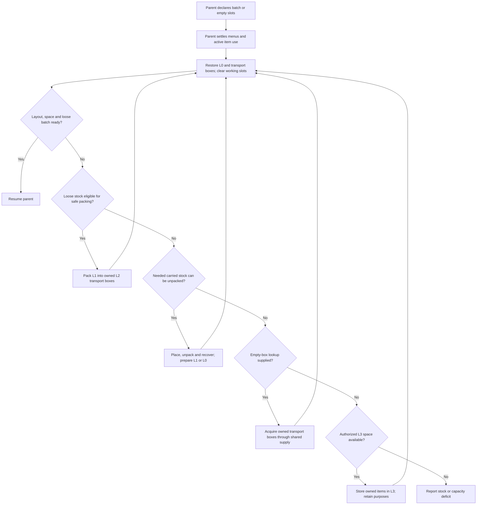

# Inventory levels

Inventory levels determine where items belong, how they reach the Bot's hands and when to arrange them. [Stock requirements](./stock) express quantities. The material ledger owns item obligations and reservations.

## Four levels

| Level | Purpose | Default main-inventory quota |
| --- | --- | --- |
| L0 | Reserved tools, rockets and food, plus temporary working slots | 12 slots |
| L1 | Directly usable items for the current task | 8 slots |
| L2 | Owned transport shulker boxes and their contents | 16 slots |
| L3 | Workstations or external containers explicitly assigned to the execution | Container capacity |

Quotas define permitted slots. Transport requirements determine how many boxes occupy L2. Armor uses separate head, chest, leg and foot slots; the chest slot holds elytra. Ender inventory retains the `ENDER` identifier with an `UNSUPPORTED` observation.

## Default L0 layout

These are internal main-inventory indices; the hotbar is 0–8.

| Index | Purpose | Capacity |
| --- | --- | --- |
| 0 | Sword | 1 item |
| 1 | Pickaxe | 1 item |
| 2 | Axe | 1 item |
| 3 | Shovel | 1 item |
| 4 | Hoe | 1 item |
| 5, 6, 9 | Propulsion rockets | 3 stacks, normally 192 rockets |
| 10, 11 | Allowed food | 2 stacks, using the chosen food's stack limit |
| 7, 8 | Working slots | Empty after arrangement |

L1 uses 12–19 and L2 uses 20–35. Native actions temporarily use the offhand; arrangement returns its items to the main inventory.

Slot purposes are fixed. Tool tags, the food whitelist and stock-level configuration determine eligible items and quantities. `layoutReady` describes slot admission; requirement `balance` fields report resource sufficiency.

Food and rockets admitted to L0 must be available for consumption. Cargo reserved by the task stays in L1 or L2. Turnover moves any L0 quantity above the available allowance back to L1, preserving task cargo and routine supplies as separate obligations.

## Selecting an item

`SelectInventorySlotAction` calls `InventoryController.selectForUse`.

1. Verify the source stack, components, count and current menu.
2. Select an existing hotbar source directly.
3. Exchange a source elsewhere in the main inventory into a hotbar working slot, preferring an empty working slot.
4. Verify the held item and exchange receipt.
5. Use the item through native placement, eating or mining.

When both working slots are occupied, the exchange moves the previous working stack to the source slot intact. Component-identical stacks still exchange whole stacks. The next safe-boundary arrangement restores their placement and clears working slots.

## Readiness and turnover

`EnsureInventoryReadyFlow` accepts a loose batch demand or required empty slots and advances arrangement, packing, unpacking and authorized L3 turnover.

```java
new EnsureInventoryReadyFlow(bot,
    Map.of(Identifier.parse("minecraft:sand"), 64L));

new EnsureInventoryReadyFlow(bot, 2, parentId)
    .withSupplySources(mode, sources, routes)
    .withIncomingStock(Map.of(Identifier.parse("minecraft:sand"), 2048L));
```

The first request exposes owned stock for direct use, from carried inventory or ledger-recorded L3 storage. [Container acquisition](./containers) and [crafting](./crafting) acquire stock that the Bot does not yet own. The second request frees working space and prepares capacity for 2,048 incoming sand. Empty boxes are acquired through the supplied source lookup and the same container-acquisition flow.

After acquiring transport boxes away from the caller, readiness uses `TravelToFlow` to return to the calling area before continuing. Bounded observed transport time contributes to the parent budget.

Packing and unpacking select a safe working position, which may move the Bot. Readiness reports inventory state; before continuing construction, the parent uses shared navigation to reach its required stance again. Declare an active loose batch through a [direct material requirement](./stock#direct-materials-for-the-active-operation) when nested turnover must retain it.



Each native operation verifies quantities, components, menu identity and box recovery. Turnover has a bounded operation budget and reports a specific failure when it cannot satisfy the request.

## Item obligations

Inventory levels and obligations are separate. Tools, borrowed items, delivery cargo and boxes awaiting installation retain their responsibilities. Owned transport boxes provide L2 packing capacity. Borrowed boxes and whole-box delivery items remain protected task items.

Ordinary mining output can move from L1 to L2 and then through authorized transport to L3. The task declares external locations. Moving an item preserves ledger claims, components and quantities.

Crafting ingredients can also be packed into transport boxes while retaining their claims. Crafting recovery uses the same readiness entry to prepare the next batch, bounded by one stack per ingredient and the remaining number of crafts. That batch stays loose during turnover. Unrelated personal items can be packed into owned transport boxes to free space, preserving their quantities and components.

`.inTaskSlots()` prepares the requested batch in L1 while retaining L0 items of the same type. For example, steak delivery keeps the reserved L0 food and promotes the task's steak from carried boxes or L3 into L1. `.withPackedCargo(predicate)` packs eligible stock beyond the current direct-use reservations into owned transport boxes.

```text
/ltv Worker exec EnsureInventoryReadyFlow {"demand":[{"item":"minecraft:sand","count":64}],"emptySlots":2,"taskSlots":true}
/ltv Worker inventory
/ltv schema EnsureInventoryReadyFlow
```

The entry returns a task ID. `demand` specifies an owned direct-use batch; `incoming` specifies capacity for the next acquisition. Both accept lists of item IDs and counts. `taskSlots` defaults to `false`; enabling it prepares the batch in L1. `emptySlots` defaults to 2 and `mode` to `REAL`; use `SOURCE_PRESERVING_DEBUG` for source-preserving acquisition. Missing empty transport boxes use Atlas lookup and the shared item acquisition workflow.

## Temporary storage and delivery

L3 holds the Bot's external stock. Delivery containers belong to a separate delivery system; each task can declare one or more.

| Operation | Bot ownership | Purposes and reservations | Delivered quantity |
| --- | --- | --- | --- |
| Store carried items in L3 | Unchanged | Retained | Unchanged |
| Retrieve from L3 | Unchanged; carried availability restored | Retained | Unchanged |
| Deposit in a delivery container | Decreased by confirmed delivery | Corresponding cargo reservation settled | Increased by confirmed delivery |

While a task is active, its delivery containers and both halves of double chests are excluded from material and refill sources. Delivered items leave L0–L3, while the task retains delivery receipts. Task termination releases its source exclusions.

Ordinary material delivery withdraws the required quantity while retaining owned transport boxes, their other contents and L0 reserves. A box explicitly requested by the task is handled as task cargo.

`StockRequirements.bindExternalStorage(owner, containers)` authorizes L3 storage. `EnsureInventoryReadyFlow` uses it when carried turnover lacks capacity and retrieves owned batches recorded in L3. `MoveExternalStockFlow` owns travel, container access and native transfer, settles partial receipts and returns to the departure area. Storage and retrieval are real transfers; source-preserving debug copies newly acquired source stock.

External ownership is saved with the material ledger and survives observation of carried inventory. Stored items must be physically retrieved before carried crafting, eating, flight or delivery can use them.

A task may explicitly release a claim on stored materials and reserve them again for a revised obligation. Claim release preserves the L3 location and item ownership, with delivered quantities unchanged. Physical retrieval makes released materials available for carried consumption.

## Invocation boundaries

- Declare phase materials and space when starting a task or entering a construction or crafting batch.
- Request a carried batch when the next action lacks loose stock but carried boxes hold it.
- Restore slots after placement, eating, source-box borrowing or offhand use at a safe boundary.
- Restore directly usable rockets after landing between flight legs.

The current operation first settles active flight, item use, container menus and outstanding box loans. Readiness advances child operations by tick; an operator initiates diagnostic queries.

## Inspection and configuration

```text
/ltv Worker inventory
```

The response includes `inventories.L0` through `inventories.L3`, `layout`, `layoutReady`, `activeDeliveryContainers` and active `requirements`. Each requirement includes both stock levels, physical and available quantities, reservations and deficits. Task items temporarily held in working slots count as L1 according to their actual purpose.

`inventoryReservedSlots`, `inventoryDirectSlots` and `inventoryBoxSlots` configure placement. All 36 main-inventory slots must be assigned once. At least two working slots are required, including one hotbar slot.

Total reserves and directly usable fuel have separate controls: total defaults are 1728 minimum and 3456 target; the direct preflight target is 192, with flight legs capped at 4096 blocks. See [rocket reserves](../navigation/fuel).
