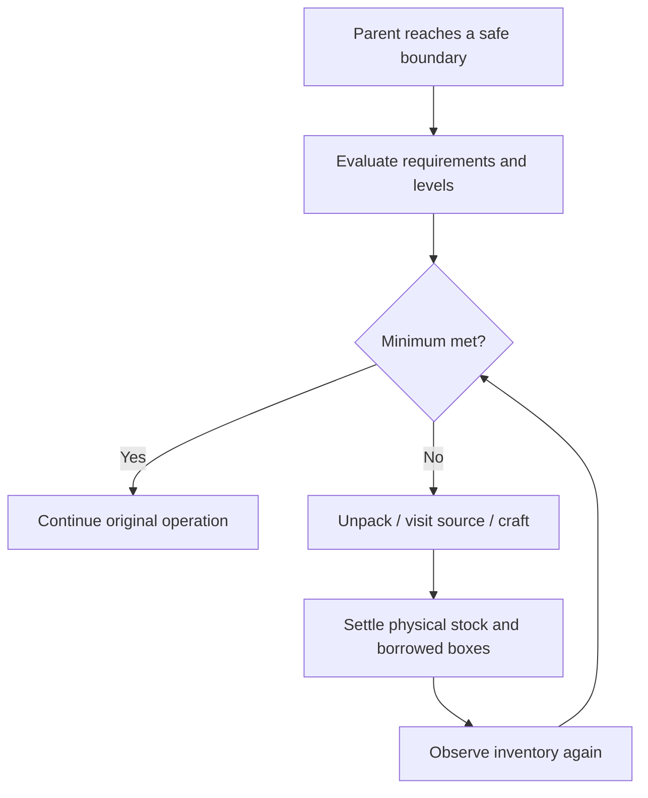

# Inventory requirements and levels

An inventory requirement describes **where stock belongs, which items qualify, its measurement unit, its minimum and its replenishment target**. Rockets, food and construction materials share quantity semantics. Travel, eating, container access and crafting retain their existing owners.

## Minimum and target

| Field | Meaning |
| --- | --- |
| `key` | Requirement name within an execution, such as `fuel`, `food` or `material:minecraft:sand` |
| `location` | Inventory tiers included in the requirement and external container locations |
| `accepts` | Item eligibility predicate |
| `unit`, `value` | Unit and quantity supplied by an item, such as rockets, nutrition or blocks |
| `minimum` | Available stock below this level creates a required deficit |
| `target` | Desired total after replenishment; at least the minimum |

Rocket defaults are 1,728 minimum and 3,456 target. Loose-food defaults are 32 and 80 nutrition. A remaining construction demand of 640 sand can use 640 for both levels.

The target determines when to stop acquiring more. Existing excess stock may remain. Each resource policy decides whether reaching the minimum is sufficient when capacity or sources limit replenishment. Tools, borrowed boxes, sponges and cargo retain their settlement protections.

## Dynamic quantities

`StockRequirement` accepts `ToLongFunction<Context>` for both levels. Context supplies the current tick, itinerary prediction and remaining material demand.

```java
context -> 1728L
context -> 3456L
context -> (long) Math.ceil(context.prediction() * 1.5)
context -> context.remainingDemand().getOrDefault(item, 0L)
```

Policies calculate quantities with these functions. Each evaluation validates `0 <= minimum <= target`. See [rocket reserves](../navigation/fuel#stock-level-modes) for `AUTO` safety and target multipliers.

## Inventory levels

| Level | Stock | Access |
| --- | --- | --- |
| `L0` | Reserved directly usable purposes: tools, rockets, food and working slots | Use directly; restore purpose slots at safe boundaries |
| `L1` | Directly usable task stock | Use directly |
| `L2` | Owned carried transport boxes and their contents | Place, open, withdraw and recover the box |
| `L3` | Explicitly authorized external containers, including workstation storage | Travel to and access the container |

Rocket reserves count `L0`, `L1` and `L2`; direct readiness counts `L0` and `L1`. Ownership and cargo reservations remain independent of storage level. Borrowed and delivery boxes retain their obligations. Ender storage reports `UNSUPPORTED`.

See [inventory levels](./inventory) for slot allocation, readiness and turnover.

### Direct materials for the active operation

A material batch needed immediately declares `L0` and `L1`, with its minimum updated as the operation progresses. Inventory turnover retains that loose batch through nested operations such as rocket promotion and box access. A sand-column operation can declare the sand still needed for its current column.

Empty shulker boxes reserved for placement are also direct task items. Inventory assignment satisfies these requirements before classifying the remaining boxes as `L2` transport capacity. For example, workstation output boxes remain protected throughout infrastructure preparation and cannot first be filled with mining drops. Their owner's requirement is released after placement completes.

Requirements that include `L2` or `L3` count stock in those locations and allow turnover into carried boxes or authorized external containers. The owning operation removes its requirements on completion, failure or cancellation. Ownership and delivery obligations retain their own accounting.

## Accounting

- **`held`**: eligible physical stock in the requirement's unit.
- **`available`**: spendable stock after ledger reservations, where a ledger is supplied. Acquisition's own material goals may measure physical acquired stock.
- **`reserved`**: physical stock minus available stock.
- **Deficits**: quantities needed to reach the minimum and target, separately.

Workstations currently register output depots. Only explicitly declared workstation requirements have stock levels; business flows arrange any transport to the station.

## Triggering replenishment

At safe boundaries, the parent calls a resource policy. The policy evaluates its requirement and uses existing carried-box unpacking, `ReplenishSuppliesFlow` and crafting operations. Food also reacts to real hunger; rocket policy maintains travel fuel.

Observation reads current physical stock and requirement functions recalculate their levels, but queries and quantity updates do not start turnover. `EnsureInventoryReadyFlow` performs organization; the parent must invoke it at a safe boundary. Updated counts therefore do not mean space has already been released: a missing readiness call can still leave an operation with a full inventory. There is currently no background organizer that can arbitrarily interrupt flight, an open container or a borrowed-box transaction.



`ResourceMaintenance` owns admission of new maintenance, budgets and same-resource recursion protection. Before starting new food or fuel maintenance, the policies inspect the current operation's unsettled effects. A borrowed box, container transfer or unsettled child operation defers new maintenance, preventing outer travel from preempting an inventory transaction. This uses the Flow settlement state; callers do not add separate box rules.

Admission applies to new maintenance. An active organization transaction can continue to completion, and unsettled outer work does not itself veto legitimate replenishment inside it. Explicit cancellation and deadlines can still leave obligations requiring reconciliation; they do not prove that a box was recovered. Requirements belong to the current execution and are cleared when it ends, is cancelled or changes.

## Querying inventory

```text
/ltv Worker inventory
/lattivium Worker inventory
```

The JSON response contains `inventories` and `requirements`. `inventories` lists items separately under `L0`, `L1`, `L2` and `L3`; `ENDER` reports `UNSUPPORTED`. Each requirement reports its included tiers, locations, units, both levels, physical and available stock, reservations and both deficits.

Loaded inventory is read live. Unloaded containers and containers with unrevealed loot appear in `unknownContainers`; deficits affected by unknown stock are `null`. A loaded location without a container appears in `absentContainers`. Queries observe loaded facts and preserve loot tables.

Idle Bots have no active execution requirements; carried stock remains queryable. See [diagnostic commands](../reference/commands).
