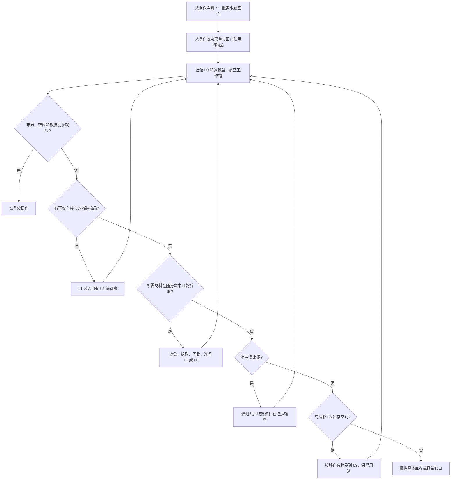

# 库存分级

库存分级决定物品放在哪里、如何拿到手上，以及何时整理。数量要求由[库存要求与水位](./stock)表达，物品归属和任务预留由材料账本管理。

## 四个层级

| 层级 | 用途 | 默认主背包配额 |
| --- | --- | --- |
| L0 | 工具、烟花、食物的预留槽，以及临时工作槽 | 12 格 |
| L1 | 当前任务需要直接使用的物品 | 8 格 |
| L2 | 自有运输潜影盒及盒内物品 | 16 格 |
| L3 | 执行明确指定的工作站或外置容器 | 按容器容量 |

配额表示允许占用的槽位。L2 根据实际运输需求携带盒子。装备使用独立的头盔、胸甲、护腿和靴子槽；胸甲槽供鞘翅使用。末影库存保留 `ENDER` 标识，查询状态为 `UNSUPPORTED`。

## L0 默认布局

以下编号采用主背包内部索引，快捷栏为 0–8。

| 索引 | 用途 | 容量 |
| --- | --- | --- |
| 0 | 剑 | 1 件 |
| 1 | 镐 | 1 件 |
| 2 | 斧 | 1 件 |
| 3 | 铲 | 1 件 |
| 4 | 锄 | 1 件 |
| 5、6、9 | 普通推进烟花 | 3 组，通常共 192 发 |
| 10、11 | 白名单食物 | 2 组，按所选食物的堆叠上限 |
| 7、8 | 工作槽 | 整理完成时保持为空 |

L1 使用 12–19，L2 使用 20–35。副手供原生动作临时使用，整理时把物品归回主背包。

槽位固定用途；物品资格和数量分别受工具标签、食物白名单及水位配置约束。`layoutReady` 表示摆放符合布局；是否持有足够资源由各项库存要求的 `balance` 表示。

食物和烟花进入 L0 时还须属于可消费库存。任务已预留的同类货物放在 L1 或 L2；整理会把 L0 中超出可消费数量的部分移回 L1。这样交付食物或烟花时，运输货物与日常补给可以同时保留各自用途。

## 把物品拿到手上

`SelectInventorySlotAction` 调用 `InventoryController.selectForUse`。

1. 核对来源堆叠、组件、数量和当前菜单。
2. 来源已在快捷栏时直接选择该槽。
3. 来源在主背包其他位置时，通过原生交换放进快捷栏工作槽，优先选择空工作槽。
4. 核对手持物品和交换回执。
5. 原生放置、进食或挖掘动作使用该物品。

两个工作槽都被占用时，交换把原工作槽物品放回来源槽，保留完整堆叠。相同物品及组件的交换仍是整堆交换。下一次安全边界整理会重新归位并清空工作槽。

## 周转入口

`EnsureInventoryReadyFlow` 接受下一批散装需求或所需空位，并推进槽位归位、装盒、拆盒及授权 L3 周转。

```java
new EnsureInventoryReadyFlow(bot,
    Map.of(Identifier.parse("minecraft:sand"), 64L));

new EnsureInventoryReadyFlow(bot, 2, parentId)
    .withSupplySources(mode, sources, routes)
    .withIncomingStock(Map.of(Identifier.parse("minecraft:sand"), 2048L));
```

第一种请求把已有材料准备为直接可用的一批，材料可来自随身库存或账本登记的 L3 暂存。获取尚未拥有的实物由[容器取货](./containers)和[合成](./crafting)负责。第二种请求释放工作空间，并为待取的 2,048 个沙子准备运输容量；需要空盒时，使用传入的来源查询和同一取货流程获取。

外出获取运输盒后，整理流程通过 `TravelToFlow` 返回调用区域，再继续原操作。运输耗时按有界的实际活动时间计入上层预算。

提供 `.withSupplySources(...)` 的补给边界还会预留盒内周转空间。`inventoryPackedSpareSlots` 默认 27，表示各自有运输盒合计至少保留 27 个空槽，供后续收纳挖掘产物、清空工作槽及拆取材料；设为 0 可关闭。待取物品的运输容量与这份余量同时计算，实际装盒后再核对余量，缺少运输盒时仍走共用取货流程。准备安装的工作站盒子、借盒和交付盒不提供这份容量。

这项预留在有来源查询的安全边界执行。没有来源查询的施工批次使用已经携带的容量及授权 L3 暂存；它不会自行获得访问任意外置容器的权限。盒内空槽与主背包空槽分别检查，主背包中尚未使用的 L2 槽不能直接收纳散装物品。

装盒和拆盒会选择安全操作位置，Bot 的实际位置可能随之改变。就绪结果描述库存；父操作继续施工前通过通用导航重新到达所需站位。需要在嵌套周转期间保持散装的当前批次，通过[直接材料要求](./stock#当前操作的直接材料)声明。

`.inTaskSlots()` 将所需批次准备到 L1，并同时保留 L0 中同类物品。例如交付牛排时，L0 食物保留在原槽，任务牛排从随身盒或 L3 取出后放入 L1。`.withPackedCargo(predicate)` 要求将符合条件、超出当前直接使用预留的物品装入自有运输盒。

```text
/ltv Worker exec EnsureInventoryReadyFlow {"demand":[{"item":"minecraft:sand","count":64}],"emptySlots":2,"taskSlots":true}
/ltv Worker inventory
/ltv schema EnsureInventoryReadyFlow
```

执行入口返回任务 ID。`demand` 表示已经拥有的散装批次，`incoming` 表示下一次取货的容量需求；二者采用物品 ID 和数量列表。`taskSlots` 默认 `false`，启用后批次使用 L1。`emptySlots` 默认 2；`mode` 默认 `REAL`，无损获取使用 `SOURCE_PRESERVING_DEBUG`。需要空运输盒时，入口通过 Atlas 查询并调用同一物品获取流程。



每次原生操作核验数量、组件、菜单和盒子回收。整理拥有有限的操作预算；无法满足请求时返回具体失败。

## 拆盒操作位置

`AccessShulkerStagingFlow` 选择放置和回收运输盒的站位。放盒格与上方保持为空，下方的 3×3 区域提供掉落物落脚面；周围区块须已加载，并满足传送门间距与实体占用检查。

当前站位可以完成操作时，直接拆取。需要移动时，已找到的安全站位作为通用寻路和飞行落点搜索的提示；导航也可到达范围内其他满足操作条件的位置。到达后重新核对实际站位、交互射线和放盒空间，再执行拆取。狭窄墙面上的 Bot 可前往附近安全地面或已登记的工作区域，在完成周转后由父流程返回施工站位。

当前任务还会记住最近一次实际验证成功的拆盒站位。附近搜索无解时，会在同维度的该站位附近再次寻找，并通过原有导航返回；每次仍检查区块加载、落脚面、实体占用和交互射线。这个位置只作为返回提示，不授予外置库存访问权限。任务结束或切换后清除，避免把上个任务的位置带入新任务。

前往拆盒位置的飞行使用直接可用烟花。菜单、盒子回收与库存回执完成后，父操作继续执行下一批工作。

## 物品责任

层级与物品责任分别记录。工具、借用物品、交付货物和待安装盒子保留其原有责任。自有运输盒提供 L2 打包空间；借来的盒子及整盒交付物品作为受保护的任务物品管理。

普通挖掘产物可以从 L1 装到 L2，再由授权的运输操作送到 L3。外置容器的位置由任务声明。物品换位置时保留账本预留、组件及数量。

合成原料也可装入运输盒，原料预留仍保留。合成恢复通过同一周转入口准备下一批原料，每种原料最多准备一组，并按剩余合成次数限制数量；当前批次在周转期间保留为散装。个人无关物品可安全装入自有运输盒以腾出空间，完整保留数量和组件。

## 暂存与交付

L3 是 Bot 的外置暂存库存。交付箱属于独立的交付体系，每个任务可指定一个或多个。

| 操作 | Bot 拥有量 | 任务用途与预留 | 已交付量 |
| --- | --- | --- | --- |
| 随身物品存入 L3 | 保持不变 | 保留 | 保持不变 |
| 从 L3 取回 | 保持不变，恢复随身可用量 | 保留 | 保持不变 |
| 放入交付箱 | 扣除实际交付量 | 结清对应货物预留 | 增加实际交付量 |

任务执行期间，其交付箱及双箱的另一半排除在材料和补给来源之外。交付物品退出 L0–L3，任务保留交付记录。结束任务时释放这次执行的来源排除。

普通材料交付只取出任务所需数量，保留自有运输盒、盒内其他物品及 L0 预留。任务明确要求交付盒子时，盒本身按任务货物处理。

`StockRequirements.bindExternalStorage(owner, containers)` 声明可暂存的 L3 容器。`EnsureInventoryReadyFlow` 在随身周转容量不足时使用这些容器；所需批次已存放在 L3 时，取回实际拥有的数量。`MoveExternalStockFlow` 执行旅行、容器访问及原生转移，并按部分转移回执结算，最后返回出发区域。暂存与取回使用真实转移；无损调试只复制新来源的获取物品。

外置所有权记录随材料账本保存。重新观察随身库存时继续保留 L3 记录；记录在 L3 的物品须实际取回后，才可用于随身合成、进食、飞行或交付。

任务可显式解除暂存材料的用途预留，再按新需求重新预留。解除预留保留 L3 位置和物品所有权，已交付量保持不变；材料实际取回后才成为随身可消费库存。

## 调用与检查时机

- 开始任务或进入新的施工、合成批次时，声明该阶段所需材料与空间。
- 下一个动作发现散装材料不足而随身盒有货时，请求拆取下一批。
- 放置、进食、借盒或副手动作结束后，在安全边界归位。
- 旅行分段落地后，为下一航段恢复直接可用烟花。

飞行、正在使用物品、容器菜单或借盒事务尚未收束时，由当前操作先处理其责任。库存就绪操作按 tick 推进子操作；界面查询由操作者发起。

## 查询与配置

```text
/ltv Worker inventory
```

返回 `inventories.L0` 至 `inventories.L3`、`layout`、`layoutReady`、`activeDeliveryContainers` 及活动 `requirements`。每项数量要求包含上下水位、实物、可用量、预留及缺口。工作槽临时持有的任务物品按其实际用途计入 L1。

布局配置为 `inventoryReservedSlots`、`inventoryDirectSlots`、`inventoryBoxSlots`。全部 36 个主背包槽位必须分配一次；至少两个工作槽，其中至少一个在快捷栏。

烟花总储备与直接可用烟花分别控制：总储备默认下限 1728、目标 3456；起飞前直接可用目标为 192，单段最长 4096 格。详见[烟花储备与补给](../navigation/fuel)。
