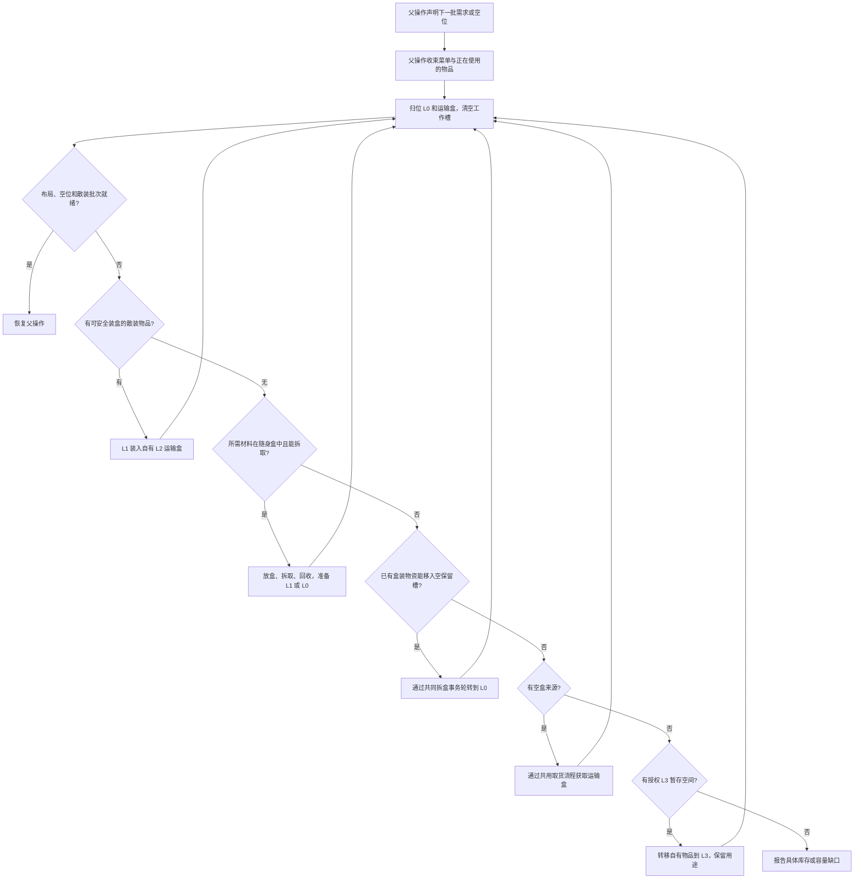

# 库存分级

库存分级决定物品放在哪里、如何拿到手上，以及何时整理。数量要求由[库存要求与水位](./stock)表达，物品归属和任务预留由材料账本管理。

挖掘、施工、取货与合成共用库存就绪入口。调用方声明当前批次、所需工作空间及允许使用的来源；库存系统决定归位、装盒、补盒与授权卸货。挖掘工地箱保留最终货物的存放回执和取消恢复记录，其接收能力由通用库存就绪流程判断。工地交付与可取回的 L3 暂存仍有不同的物品责任。普通 BEST_EFFORT 挖掘未声明卸货点时，不为凑够四个空槽强制远行取盒。

## 四个层级

| 层级 | 用途 | 默认主背包配额 |
| --- | --- | --- |
| L0 | 工具、烟花、食物的预留槽，以及临时工作槽 | 12 格 |
| L1 | 当前任务需要直接使用的物品 | 8 格 |
| L2 | 自有运输潜影盒及盒内物品 | 16 格 |
| L3 | 执行明确指定的工作站或外置容器 | 按容器容量 |

配额表示允许占用的槽位。L2 根据实际运输需求携带盒子。装备使用独立的头盔、胸甲、护腿和靴子槽；胸甲槽供鞘翅使用。末影库存保留 `ENDER` 标识，查询状态为 `UNSUPPORTED`。

## L0 默认布局

以下编号采用主背包内部索引，快捷栏为 0–8。

| 索引 | 用途 | 容量 |
| --- | --- | --- |
| 0 | 剑 | 1 件 |
| 1 | 镐 | 1 件 |
| 2 | 斧 | 1 件 |
| 3 | 铲 | 1 件 |
| 4 | 锄 | 1 件 |
| 5、6、9 | 普通推进烟花 | 3 组，通常共 192 发 |
| 10、11 | 白名单食物 | 2 组，按所选食物的堆叠上限 |
| 7、8 | 工作槽 | 整理完成时保持为空 |

L1 使用 12–19，L2 使用 20–35。副手供原生动作临时使用，整理时把物品归回主背包。

槽位固定用途；物品资格和数量分别受工具标签、食物白名单及水位配置约束。`layoutReady` 表示摆放符合布局；是否持有足够资源由各项库存要求的 `balance` 表示。

食物和烟花进入 L0 时还须属于可消费库存。任务已预留的同类货物放在 L1 或 L2；整理会把 L0 中超出可消费数量的部分移回 L1。这样交付食物或烟花时，运输货物与日常补给可以同时保留各自用途。


### 消费自己的材料

原生放容器和向容器存货默认检查共同的槽位、组件和用途保护。需要消费自身声明的操作，传递该声明的 owner：工作站安装输出盒或存入自己的物资时可减少自身库存；其他 owner 的直接材料、工具和借盒责任继续保留。调用方不能关闭整条保护规则，也不再维护一个“找第一个可用盒”的扫描器。采购需要的空盒数量也按这份可消费库存计算：两只待安装盒不满足第三只工地卸货盒的需求。


## 共同库存移动

整理、选工作槽、换副手和装备鞘翅都由 `InventoryController` 检查移动前后各位置的实际库存，使用同一 `StockRequirements.permitsRelocation` 合同。被移动的物品和被换出的物品都必须保留其他 owner 的槽位、组件及加权最低量；只能移动多余部分时，整理按允许数量转移。内部移动保持总数量与账本用途，不记消费或采购。

拆取潜影盒同样是位置迁移：共同盒子执行器必须比较原库存和完整执行计划的结果，保留其他 owner 的 L2 最低量。不能先拆出受保护物品，再按改变后的位置重新降低保护量。若多取兼容物品会违反最低量，只执行合法的精确批次；业务批量准备使用 `EnsureInventoryReadyFlow.withConsumingOwners(Set<UUID>)` 显式传递自己的授权。

烟花整栈移到副手与使用一发烟花分别检查。前者是位置变化，后者才减少库存并结算 TRAVEL；工具或货物的用途预留不禁止合法的内部搬运。显式业务 owner 只授权自己的声明，其他声明仍保留。

## 共同消费准备

普通施工消费者调用 `Flow.prepareInventoryConsumption(item, minimum, consumingOwners, server, tick)` 声明下一次原生需求，通常为 1 件。共同 `PrepareInventoryConsumptionFlow` 负责可消费数量、授权 L2 拆取、工作槽选择和取消清理；父 Flow 在几何检查前调用 `finishInventoryConsumptionPreparation` 推进同一请求，再重新校验实际站位与交互条件。effect 前再次检查 `selectedConsumptionLimit`，忙碌菜单或库存事务不可消费。

`consumingMaterialOwner(UUID)` 明确授权相应业务声明。消费者自身 UUID 与显式业务 owner 是权限；trace parent、目标坐标及继承的来源访问不授予消费权限。没有相关材料声明的父操作不需要新增 owner 豁免。

`InventoryController.consumptionLimits` 统一检查组件、加权 L0/L1/L2 最低量、槽位角色和账本预留。进食与推进明确声明 FOOD/FIREWORKS 角色，普通材料没有这些豁免；角色豁免仍保留其他 owner 的数量下限。营养下限按单件真实营养值保留整件食物。`creditedPurpose` 与精确 `creditedReservation` 只能抵扣该消费者已持有的同用途预留，不能豁免 TOOL 或交付责任。

原生数量与返回产物回执确认后，提交精确 `confirmConsumption(removed, returned)`，例如放一块提交 removed=1、returned=0。它不重扫整背包、不释放既有预留；已有 reserve/settle 消费合同沿用原收据，不能重复记账。装盒与拆盒只是数量、组件守恒的搬运，不产生消费或采购收据。原生合同门禁验证消费与搬运规则，完整现场验收单独执行。

## 把物品拿到手上

`SelectInventorySlotAction` 调用 `InventoryController.selectForUse`。

1. 核对来源堆叠、组件、数量和当前菜单。
2. 来源已在快捷栏时直接选择该槽。
3. 来源在主背包其他位置时，通过原生交换放进快捷栏工作槽，优先选择空工作槽。
4. 核对手持物品和交换回执。
5. 原生放置、进食或挖掘动作使用该物品。

两个工作槽都被占用时，交换把原工作槽物品放回来源槽，保留完整堆叠。相同物品及组件的交换仍是整堆交换。下一次安全边界整理会重新归位并清空工作槽。

## 周转入口

`EnsureInventoryReadyFlow` 接受下一批散装需求或所需空位，并推进槽位归位、装盒、拆盒及授权 L3 周转。

运输盒无法再装入散装物品时，库存系统也会检查 L0 保留槽的实际接收空间。符合共同资格且可消费的已拥有盒装物资，可以通过同一拆盒事务移入空保留槽，释放盒内空间，再继续装盒和工作槽归位。这只是随身层级之间的轮转，不是额外采购或修改补给水位；待安装/交付盒、任务预留及不同组件仍受保护。全部可用角色和运输容量都满时仍会拒绝，不能把空的 L2 主背包槽当作散装容量。

装盒规划会先合并自有运输盒内相同物品、相同组件的碎堆，再判断整批散装物品是否可放入；占满27格不一定代表容量已经用尽。规划只读取随身盒，实际合并和转入通过已放置自有盒的同一原生事务完成。名称等组件不同的碎堆不合并，待安装和交付盒也不参与。取消发生在盒子归还前时，仍保留未结盒子责任，不能用已完成的转移代替盒子回收。

施工流程声明当前批次的直接需求，库存系统决定哪些余量可以装盒，不再用施工方自己的材料类别名单禁止周转。例如已有128个白混凝土、当前直接需求64个时，余下64个可在需要腾空间时装盒；如果直接需求是128个，则全部保留为散装，空间不足仍会明确拒绝。工具、日常补给、待安装容器和任务货物继续遵循共同库存声明与所有权保护。

```java
new EnsureInventoryReadyFlow(bot,
    Map.of(Identifier.parse("minecraft:sand"), 64L));

new EnsureInventoryReadyFlow(bot, 2, parentId)
    .withInventorySupplyAccess(new InventorySupplyAccess(mode, sources, routes))
    .withIncomingStock(Map.of(Identifier.parse("minecraft:sand"), 2048L));
```

第一种请求把已有材料准备为直接可用的一批，材料可来自随身库存或账本登记的 L3 暂存。获取尚未拥有的实物由[容器取货](./containers)和[合成](./crafting)负责。第二种请求释放工作空间，并为待取的 2,048 个沙子准备运输容量；需要空盒时，使用传入的来源查询和同一取货流程获取。

外出获取运输盒后，默认 `RESTORE_ORIGIN` 合同通过 `TravelToFlow` 返回调用区域，再继续被暂停的操作。位置无关的旅行准备可明确声明 `CONTINUE_AT_SOURCE`：取得空盒后仍完成容量与布局整理，然后从实际位置继续。当前只有燃料初始容量准备使用该接续；其收尾整理仍采用默认返回合同。接续方式由同一个库存 owner 执行，取得凭证、盒子归属、失败和取消清理保持相同；运输耗时按有界的实际活动时间计入上层预算。

`InventorySupplyAccess` 只登记查找和获取运输盒的能力，不增加容量需求。默认额外备用容量为 0：库存系统先扣除 L1 空槽及可合并堆栈的空间，再按待入库数量与现有 L2 容量计算需获取的运输盒。没有待入库物品或入库数量能放进 L1 时，不会仅因登记了来源而出门拿盒。

补给访问权限在根执行处声明，包含执行模式、来源查询及允许的旅行路线；子流程通过执行作用域继承，不能在容量不足时自行换成 Atlas 查询器。需要限制权限的入口明确屏蔽继承。权限只提供执行能力，不拥有来源查询器，也不添加容量需求。合成、施工和取货复用同一就绪入口，不再通过各自的回调转发取盒逻辑。

直接保护数量按实际槽位、组件和声明交集计算。相同物品 ID 的不同名称或组件不能替代彼此的保护数量；待安装盒优先保留在合法 L1 槽，运输盒身份在整理换槽后保持收敛。装盒先使用已有盒内的实际合并空间，再决定是否需要外部补给。

任务若需要为后续挖掘产物等保留额外空间，显式调用 `.withPackingHeadroom(27)`，表示自有运输盒内部合计保留 27 个空槽。该需求与待入库容量一起由库存系统处理，不要求某只盒子完全为空，也不是烟花的 1728 发备用水位。准备安装的工作站盒子、借盒和交付盒不提供运输容量。没有来源查询时只使用已有容量及授权 L3 暂存，不会自行获得访问任意外置容器的权限。盒内空槽与主背包空槽分别检查，主背包中尚未使用的 L2 槽不能直接收纳散装物品。

装盒和拆盒会选择安全操作位置，Bot 的实际位置可能随之改变。就绪结果描述库存；父操作继续施工前通过通用导航重新到达所需站位。需要在嵌套周转期间保持散装的当前批次，通过[直接材料要求](./stock#当前操作的直接材料)声明。

`.inTaskSlots()` 将所需批次准备到 L1，并同时保留 L0 中同类物品。例如交付牛排时，L0 食物保留在原槽，任务牛排从随身盒或 L3 取出后放入 L1。`.withPackedCargo(predicate)` 要求将符合条件、超出当前直接使用预留的物品装入自有运输盒。

`EnsureInventoryReadyFlow.nextOutgoingBatch(bot, remaining, predicate, parentId)` 为交付和工地卸货准备一批 L1 出库物品。批次已在获准的 L1 来源槽时，可先执行数量与组件核验的转移，释放空位，再归位其他物品；不会因无关 L0 槽物品尚未归位而阻止这次出库。仅有盒装货物时仍需通用拆盒。此结果表示出库批次就绪，不保证查询中的 `layoutReady` 已为 `true`。普通入库、使用准备及指令的 `taskSlots: true` 仍要求完整布局就绪；出库目标不会自动成为 L3 暂存或取货来源。

出库准备与实际转移共用按来源槽、组件和位置计算的数量上限。`items` 单位的直接材料要求保留在其声明的 L0/L1 范围内，不能只在 L2 留下同类物品就认为满足。声明仅含 L1 时，L0 的同类物品不能替代；多个重叠声明各自检查下限，同一份物品可以同时满足它们，不机械相加。已经低于下限的库存也不会被这次出库进一步减少。

`InventoryController.outgoingAvailable(predicate)` 表示当前合法 L1 来源槽能立即出库的数量；`outgoingRetained(predicate)` 表示真正受保护的散装数量。暂存在工作槽或错位槽的普通货物仍然是 L1 货物，只是需要先归位，不能被误算成新增预留。`TransferItemsFlow` 对玩家库存出库默认应用共同数量上限，交付、工地卸货和 L3 存入无需另行启用保护。每次真实转移和重试前重新核对；未转出的数量继续保留在请求及实际回执中。

工具归属与任务货物仍由材料账本管理：工具预留保留，最终交付货物可按授权交付并结算。工作站投放自己的准备材料时，通过 `consumingStockOwner(uuid())` 授权消费本流程的数量声明；其他 owner 的声明仍受保护，目标坐标不会自动授予这项权限。此处的直接数量保护不替代食物营养或总烟花储备的补给水位。

任务通过 `InventorySupplyAccess(mode, sources, routes)` 声明库存周转可以借用的来源，子 `Flow` 在执行时继承；裸就绪流程不会自行获得 Atlas 权限。明确的 `withoutInventorySupplyAccess()` 限制整个子树，后代不能重新授权。来源创建者负责关闭来源；根执行的 `ResourceMaintenance` 会话和累计预算见[共同维护](./maintenance#容量与上下文)。

装箱选择同时保留物品资格谓词和精确组件，逐个尝试每只自有运输盒可容纳的候选。首项放不下时继续检查后项，失败的部分并堆模拟不会写回。选择比较实际转移会释放的来源槽；盒子 27 格都占用时，相同组件的未满堆叠仍可能提供容量。

```text
/ltv Worker exec EnsureInventoryReadyFlow {"demand":[{"item":"minecraft:sand","count":64}],"emptySlots":2,"taskSlots":true}
/ltv Worker inventory
/ltv schema EnsureInventoryReadyFlow
```

执行入口返回任务 ID。`demand` 表示已经拥有的散装批次，`incoming` 表示下一次取货的容量需求；二者采用物品 ID 和数量列表。`packingHeadroomSlots` 默认 0，显式设置为 27 可预留一整盒的内部空容量，实际上限由 L2 配额约束。`taskSlots` 默认 `false`，启用后批次使用 L1。`emptySlots` 默认 2；`mode` 默认 `REAL`，无损获取使用 `SOURCE_PRESERVING_DEBUG`。需要空运输盒时，入口通过 Atlas 查询并调用同一物品获取流程。



每次原生操作核验数量、组件、菜单和盒子回收。整理拥有有限的操作预算；无法满足请求时返回具体失败。

就绪请求中的材料数量是最低可用量。拆取自有运输盒时，共用盒交换规划先保证所有最低需求都能装入，再用同组件材料填满已有接收堆栈的余量；这一步不增加占用槽位、不额外装箱或采购。容量紧张时仍使用最小可行数量。已满足请求时不重复拆箱；普通取货和交付仍按各自的明确数量执行，命名及其他不匹配组件不能替代所需材料。

跨 tick 装箱保留已放置盒子的临时所有权，转移和回收前核对同维度、同 Bot 和原方块实体。即使外部替换成同种潜影盒，也不能继续写入或拆掉替代箱。解除观察只释放该 token；未归还的运输盒仍是待结算义务，不会因失败或取消自动消失。

## 拆盒操作位置

`AccessShulkerStagingFlow` 选择放置和回收运输盒的站位。放盒格与上方保持为空，下方的 3×3 区域提供掉落物落脚面；周围区块须已加载，并满足传送门间距与实体占用检查。

当前站位可以完成操作时，直接拆取。需要移动时，已找到的安全站位作为通用寻路和飞行落点搜索的提示；导航也可到达范围内其他满足操作条件的位置。到达后重新核对实际站位、交互射线和放盒空间，再执行拆取。狭窄墙面上的 Bot 可前往附近安全地面或已登记的工作区域，在完成周转后由共同消费准备返回最初消费位置，再由业务复核实际施工站位。

当前任务还会记住最近一次实际验证成功的拆盒站位。附近搜索无解时，会在同维度的该站位附近再次寻找，并通过原有导航返回；每次仍检查区块加载、落脚面、实体占用和交互射线。这个位置只作为返回提示，不授予外置库存访问权限。任务结束或切换后清除，避免把上个任务的位置带入新任务。

前往拆盒位置的飞行使用直接可用烟花，不能用尚未打开的盒子给这段飞行补燃料。若起飞前明确缺少散装烟花，且 Bot 已落地、前一子操作清理完成，则保留已找到的安全位置，使用原有地面／水路寻路再规划一次。仍然无路时保留失败，不在空中拆盒、不放宽安全条件。菜单、盒子回收与库存回执完成后，父操作继续执行下一批工作。

## 嵌套周转与挖掘检查

挖掘中的导航或对齐子操作可能先触发烟花补给，再临时放下自有运输盒。暂停的挖掘父操作让这个子事务先完成转移和盒子回收；不能把子事务刚放下的盒子当成新的拆除障碍，在回收前中断它。

`MiningTarget` 在创建时检查准入，`validateMiner` 和 `BlockMiningSession` 在恢复挖掘及每次原生挖掘效果前重新检查当前状态、授权和周围保护。周转结束后出现的外来容器仍会阻止挖掘。这不是自有盒的保护豁免。

双格植物的等待检查只核对两半是否加载、同种且互补，并位于授权内。完整的拆除检查由同一挖掘目标执行，覆盖两半各自的邻域；完成回执须证明两半都实际消失。取消或失败仍通过现有子操作清理通道结算，未归还的盒子保留阻塞。

子操作的业务结果与清理结果分别保存。`ExecutionScope.requireCleanCleanup()` 是 Flow 与直接调度子操作的 Task 共用的交接检查：盒子、菜单或输入清理失败时，先保留责任和错误，再拒绝进入下一阶段。清理回调与子操作、根输入同时报错时，两种原因都保留；业务成功回执不会被改写成已完成安全交接。

`EventHandle.cleanupFailure()` 提供独立的清理结果。完整状态查询中的任务 `cleanupFailure` 与根调度器的 `cleanupBlockedBy` 用于核对待处理责任；根阻塞存在时不能提交新操作。新完整快照带有 `cleanupSchemaVersion: 1`，测试入口保存终态后检查这两个字段，清理失败即拒绝验收。历史记录保留原覆盖范围，不补写这项新测量；观察范围不完整、任务身份不匹配或旧运行时未提供清理测量，均不能作为新测试通过的依据。

## 物品责任

层级与物品责任分别记录。工具、借用物品、交付货物和待安装盒子保留其原有责任。自有运输盒提供 L2 打包空间；借来的盒子及整盒交付物品作为受保护的任务物品管理。

普通挖掘产物可以从 L1 装到 L2，再由授权的运输操作送到 L3。外置容器的位置由任务声明。物品换位置时保留账本预留、组件及数量。

合成原料也可装入运输盒，原料预留仍保留。合成恢复通过同一周转入口准备下一批原料，每种原料最多准备一组，并按剩余合成次数限制数量；当前批次在周转期间保留为散装。个人无关物品可安全装入自有运输盒以腾出空间，完整保留数量和组件。

## 暂存与交付

L3 是 Bot 的外置暂存库存。交付箱属于独立的交付体系，每个任务可指定一个或多个。

| 操作 | Bot 拥有量 | 任务用途与预留 | 已交付量 |
| --- | --- | --- | --- |
| 随身物品存入 L3 | 保持不变 | 保留 | 保持不变 |
| 从 L3 取回 | 保持不变，恢复随身可用量 | 保留 | 保持不变 |
| 放入交付箱 | 扣除实际交付量 | 结清对应货物预留 | 增加实际交付量 |

任务执行期间，其交付箱及双箱的另一半排除在材料和补给来源之外。交付物品退出 L0–L3，任务保留交付记录。结束任务时释放这次执行的来源排除。

普通材料交付只取出任务所需数量，保留自有运输盒、盒内其他物品及 L0 预留。任务明确要求交付盒子时，盒本身按任务货物处理。

`StockRequirements.bindExternalStorage(owner, containers)` 声明可暂存的 L3 容器。`EnsureInventoryReadyFlow` 在随身周转容量不足时使用这些容器；所需批次已存放在 L3 时，取回实际拥有的数量。`MoveExternalStockFlow` 执行旅行、容器访问及原生转移，并按部分转移回执结算，最后返回出发区域。暂存与取回使用真实转移；无损调试只复制新来源的获取物品。

外置所有权记录随材料账本保存。重新观察随身库存时继续保留 L3 记录；记录在 L3 的物品须实际取回后，才可用于随身合成、进食、飞行或交付。

任务可显式解除暂存材料的用途预留，再按新需求重新预留。解除预留保留 L3 位置和物品所有权，已交付量保持不变；材料实际取回后才成为随身可消费库存。

## 调用与检查时机

- 开始任务或进入新的施工、合成批次时，声明该阶段所需材料与空间。
- 下一个动作发现散装材料不足而随身盒有货时，请求拆取下一批。
- 放置、进食、借盒或副手动作结束后，在安全边界归位。
- 旅行分段落地后，为下一航段恢复直接可用烟花。

飞行、正在使用物品、容器菜单或借盒事务尚未收束时，由当前操作先处理其责任。库存就绪操作按 tick 推进子操作；界面查询由操作者发起。

## 查询与配置

L3 报告按双箱的两个物理半箱计数并去重，即使两侧地址同时登记也只计一次。已加载的半箱必须具有同种箱体、相同朝向和互补的 LEFT/RIGHT 状态，旁边独立的容器不计入。未加载的疑似另一半、有未展开 loot table 的库存仍是未知，报告为 PARTIAL；查询不加载区块或生成战利品。来源排除继续采用保守保护范围，与库存计数的职责分开。

```text
/ltv Worker inventory
```

返回 `inventories.L0` 至 `inventories.L3`、`layout`、`layoutReady`、`activeDeliveryContainers` 及活动 `requirements`。每项数量要求包含上下水位、实物、可用量、预留及缺口。工作槽临时持有的任务物品按其实际用途计入 L1。

布局配置为 `inventoryReservedSlots`、`inventoryDirectSlots`、`inventoryBoxSlots`。全部 36 个主背包槽位必须分配一次；至少两个工作槽，其中至少一个在快捷栏。

烟花总储备与直接可用烟花分别控制：总储备默认下限 1728、目标 3456；起飞前直接可用目标为 192，单段最长 4096 格。详见[烟花储备与补给](../navigation/fuel)。
