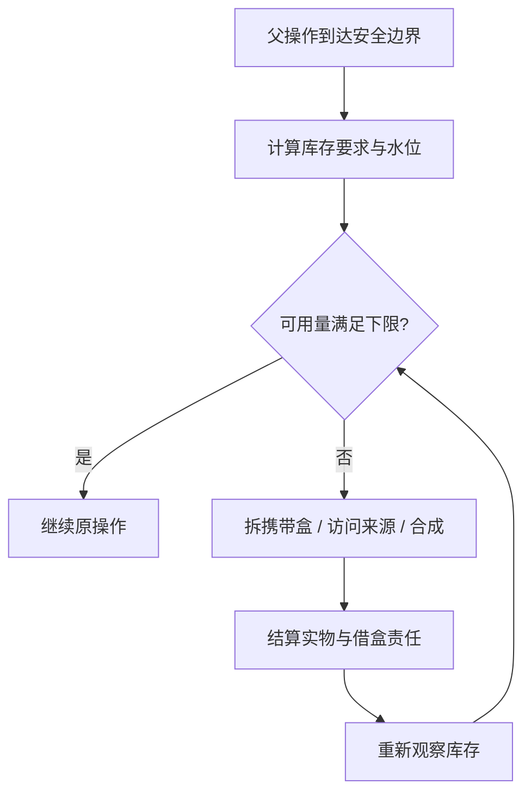

# 库存要求与水位

库存要求描述：**哪个位置、哪些物品、用什么单位计量，以及下限和补足目标是多少**。烟花、食物与施工材料共用数量语义；旅行、进食、容器访问及合成继续由各自组件执行。

## 下限与目标

| 字段 | 意义 |
| --- | --- |
| `key` | 该执行中要求的名称，如 `fuel`、`food`、`material:minecraft:sand` |
| `location` | 要求统计的库存层级，以及外置容器位置 |
| `accepts` | 可计入该要求的物品筛选器 |
| `unit`、`value` | 单位及每个物品提供的数量，如发数、营养值、方块数 |
| `minimum` | 可用量低于此值时出现必需缺口 |
| `target` | 一次补给希望达到的总量，要求不低于下限 |

例如烟花下限 1,728、目标 3,456；散装食物默认下限 32 营养、目标 80 营养。剩余施工需求为 640 个沙子时，材料要求可把两者都设为 640。

目标是补取的停止水位。已有库存超过目标仍可保留。容量受限或来源稀缺时，是否达到下限即可继续由资源策略决定；工具、借盒、海绵和货物结算保持各自的保护。

## 动态数量

`StockRequirement` 的下限和目标接受 `ToLongFunction<Context>`。上下文包含当前 tick、行程预测和剩余物品需求。

```java
context -> 1728L                        // 固定下限
context -> 3456L                        // 固定目标
context -> (long) Math.ceil(context.prediction() * 1.5)
context -> context.remainingDemand().getOrDefault(item, 0L)
```

策略可以用函数计算数量。每次计算校验 `0 ≤ minimum ≤ target`。烟花 `AUTO` 的安全系数和目标系数详见[烟花储备与补给](../navigation/fuel#两种水位模式)。

## 库存分级

| 层级 | 库存 | 使用方式 |
| --- | --- | --- |
| `L0` | 工具、烟花、食物及工作槽等固定用途的直接可用物品 | 直接使用，在安全边界恢复用途槽位 |
| `L1` | 直接可用的任务物品 | 直接使用 |
| `L2` | 自有随身运输盒及其内容 | 放置、打开、拆取并回收盒子 |
| `L3` | 明确授权的外置容器，包括工作站库存 | 前往容器并访问 |

烟花储备统计 `L0`、`L1` 与 `L2`；直接就绪数量统计 `L0` 与 `L1`。物品所有权和货物预留独立于存放层级，借盒和交付盒保留各自责任。末影库存显示 `UNSUPPORTED`。

槽位配置、库存就绪和周转见[库存分级](./inventory)。

### 当前操作的直接材料

需要立刻使用的材料批次声明在 `L0`、`L1`，下限随剩余操作更新。库存整理会保留这批散装材料，使补烟花、拆盒等嵌套操作完成后，父操作仍能直接使用它们。例如沙柱施工可声明当前柱剩余所需的沙子。

准备放置的空潜影盒也属于直接任务物品。整理背包时先满足这些要求，再把剩余盒子划为 `L2` 运输容量。例如建工作站需要的输出盒会从前置施工开始保留，不能先拿来装挖出的材料；完成放置后解除该操作的要求。

包含 `L2`、`L3` 的要求按这些位置统计库存，允许周转到携带盒或授权外置容器。要求由所属操作在完成、失败或取消时移除；所有权、交付义务仍由各自账目管理。

## 库存账目

- **实物 `held`**：符合筛选器的物品，按该要求的单位计量。
- **可用 `available`**：有材料账本时，扣除其他用途预留后的可消费量；材料获取自身的目标可按已取得实物衡量。
- **预留 `reserved`**：实物与可用量之差。
- **缺口**：分别报告到下限和到目标还差多少。

工作站目前登记输出容器。只有明确声明的工作站库存要求才具有水位；自动运输到工作站由业务流程安排。

## 谁触发补给

父操作在安全边界调用资源策略。策略使用库存要求判断数量，通过已有携带盒拆取、`ReplenishSuppliesFlow` 和合成流程完成补给。食物策略还根据真实饥饿触发进食，烟花策略处理旅行燃料。



`ResourceMaintenance` 管理预算和同类递归保护。库存要求属于当前执行；结束、取消及下一次执行切换时清除。

## 查询库存

```text
/ltv Worker inventory
/lattivium Worker inventory
```

返回 JSON，包含 `inventories` 和 `requirements`。`inventories` 按 `L0`、`L1`、`L2`、`L3` 分别列出物品；`ENDER` 显示 `UNSUPPORTED`。每项要求包括统计的层级、位置、单位、上下水位、实物、可用量、预留及两种缺口。

已加载库存即时读取。未加载容器或尚未揭示战利品的容器列入 `unknownContainers`；受未知库存影响的缺口为 `null`。已加载但容器不存在时列入 `absentContainers`。查询只观察已加载事实，保留战利品表。

空闲 Bot 没有活动执行要求，仍可查询携带实物。诊断命令见[诊断命令](../reference/commands)。
